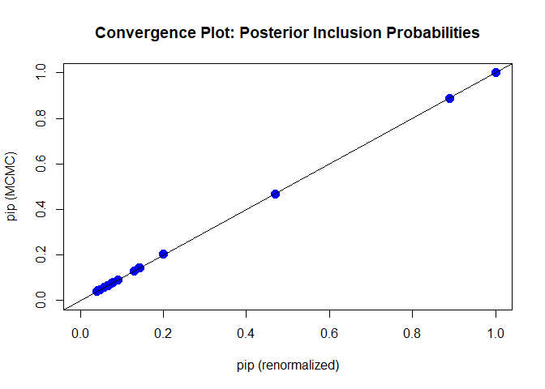
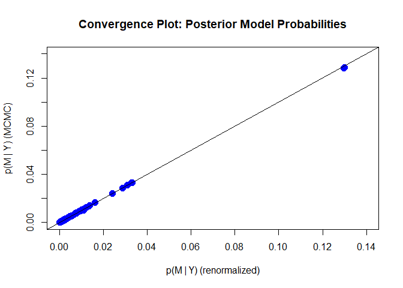
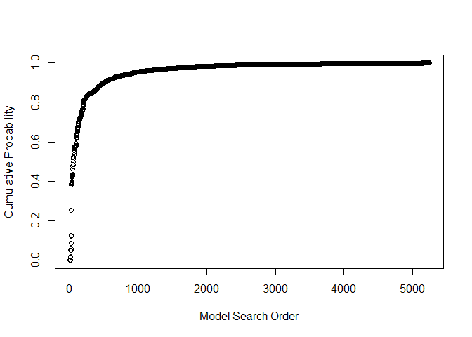
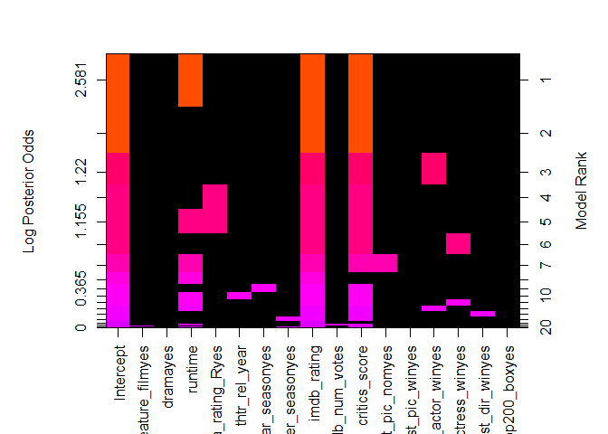
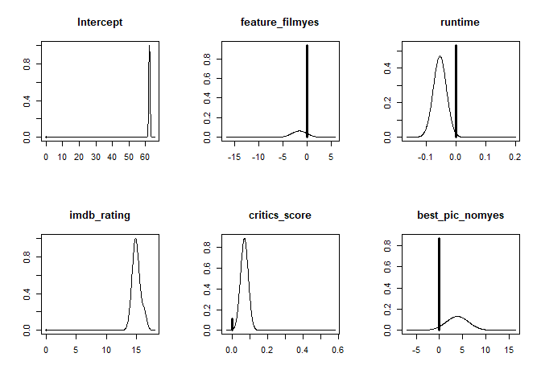

Movie audience score prediction with bayesian multiple regression
================
Ian Finneran

### Load packages

``` r
library(ggplot2)
library(GGally)
library(dplyr)
library(tidyverse)
library(statsr)
library(broom)
library(ggpubr)
library(BAS)
library(reshape2)
library(rmarkdown)
```

### Load data

``` r
load("movies.Rdata")
set.seed(31214)
```

-----

## Part 1: Data

The data set consists of 651 randomly sampled movies from
[IMDB](https://www.imdb.com/) and [Rotten
Tomatoes](https://www.rottentomatoes.com/) (RT) between 1970 - 2014. No
information is given on the technique used for the sampling. If we
assume a true random sample, then the results can be generalized to all
movies that are on IMDB and RT in this timeframe. The movies are not
randomly assigned, so only association can be found between variables.
In other words, causal inference is not possible.

The research question is: what is the optimal Bayseian multiple
regression model for predicting RT audience score? Specifically, I am
interested in finding the best predictive hierarchical model using
Bayseian model averaging. Which variables are most predictive?

-----

## Part 2: Data manipulation

First I use mutate on the movies data set to make the new explanatory
variables:

  - `feature_film` (yes if title\_type is Feature Film / no otherwise)
  - `drama` (yes if genre is Drama / no otherwise)
  - `mpaa_rating_R` (yes if mpaa\_rating is R / no otherwise)
  - `oscar_season` (yes if month is 10, 11, or 12 / no otherwise)
  - `summer_season` (yes if month is 5, 6, 7, or 8 / no otherwise)

Next, I select all 16 explanatory variables used in the analysis and
store them in df along with the response variable `audience_score`. This
includes the new variables as well as the following:

  - `runtime`
  - `thtr_rel_year`
  - `imdb_rating`
  - `imdb_num_votes`
  - `critics_score`
  - `best_pic_nom`
  - `best_pic_win`
  - `best_actor_win`
  - `best_actress_win`
  - `best_dir_win`
  - `top200_box`

<!-- end list -->

``` r
df = movies %>% mutate(feature_film = ifelse(title_type=="Feature Film","yes","no")) %>% 
  mutate(drama = ifelse(genre=="Drama",'yes','no')) %>%
  mutate(mpaa_rating_R = ifelse(mpaa_rating=="R","yes","no")) %>%
  mutate(oscar_season = ifelse(thtr_rel_month==10 | thtr_rel_month==11 | thtr_rel_month==12,
                                 "yes","no")) %>%
  mutate(summer_season = ifelse(thtr_rel_month==5 | thtr_rel_month==6 | thtr_rel_month==7 | 
                                   thtr_rel_month==8,"yes","no")) %>%  
  select(audience_score, feature_film, drama, runtime, mpaa_rating_R, thtr_rel_year,
         oscar_season, summer_season, imdb_rating, 
         imdb_num_votes, critics_score, best_pic_nom, best_pic_win,
         best_actor_win, best_actress_win, best_dir_win, top200_box) 
# convert categorical variables to factor type so they will be properly treated in the plotting
df = df %>% mutate_if(sapply(df, is.character), as.factor) %>% na.omit()
# Note: There is only 1 NA value, so it is safe to omit it. If there were more, I would more 
# carefully consider omission and make sure that it doesn't cause a bias in the sample. 
```

-----

## Part 3: Exploratory data analysis

First let’s take a look at some summary statistics for the variables:

``` r
summary(df)
```

    ##  audience_score  feature_film drama        runtime      mpaa_rating_R
    ##  Min.   :11.00   no : 59      no :345   Min.   : 39.0   no :321      
    ##  1st Qu.:46.00   yes:591      yes:305   1st Qu.: 92.0   yes:329      
    ##  Median :65.00                          Median :103.0                
    ##  Mean   :62.35                          Mean   :105.8                
    ##  3rd Qu.:80.00                          3rd Qu.:115.8                
    ##  Max.   :97.00                          Max.   :267.0                
    ##  thtr_rel_year  oscar_season summer_season  imdb_rating   
    ##  Min.   :1970   no :460      no :442       Min.   :1.900  
    ##  1st Qu.:1990   yes:190      yes:208       1st Qu.:5.900  
    ##  Median :2000                              Median :6.600  
    ##  Mean   :1998                              Mean   :6.492  
    ##  3rd Qu.:2007                              3rd Qu.:7.300  
    ##  Max.   :2014                              Max.   :9.000  
    ##  imdb_num_votes   critics_score    best_pic_nom best_pic_win
    ##  Min.   :   180   Min.   :  1.00   no :628      no :643     
    ##  1st Qu.:  4584   1st Qu.: 33.00   yes: 22      yes:  7     
    ##  Median : 15204   Median : 61.00                            
    ##  Mean   : 57620   Mean   : 57.65                            
    ##  3rd Qu.: 58484   3rd Qu.: 83.00                            
    ##  Max.   :893008   Max.   :100.00                            
    ##  best_actor_win best_actress_win best_dir_win top200_box
    ##  no :557        no :578          no :607      no :635   
    ##  yes: 93        yes: 72          yes: 43      yes: 15   
    ##                                                         
    ##                                                         
    ##                                                         
    ## 

A few observations we can make from this summary:

  - The response variable `audience_score` has median of 65 and an IQR
    of 34.
  - The categorical explanatory variables `best_pic_win` and
    `top200_box` have very few samples in the `yes` category. This means
    that these `yes` points will have a large influence over the fitted
    slopes in these categories.
  - The numerical explanatory variable `imdb_num_votes` is extremely
    right skewed, with mean = 57620 and median = 15204.

Now I will make a pairs plot for all of the numerical variables to
examine the scatter plots, distributions, and correlation coefficients
between pairs of variables.

``` r
df %>% select(audience_score, runtime, thtr_rel_year, imdb_rating,
         imdb_num_votes, critics_score) %>% ggpairs(axisLabels = 'none')
```

<!-- -->

Here, we can see that `imdb_rating` and `critics_score` both have
moderately strong positive correlations with audience score.
`imdb_num_votes` and `runtime` have weak positive correlations with
`audience_score` and `thtr_rel_year` has almost no correlation at all.
For `imdb_num_votes` it seems that there may be a nonlinear relationship
with `audience_score` or a non-constant variance. Finally, there is
moderate correlation between `critics_score` and `imdb_rating`,
indicating colinearity between these variables.

Next, I’ll make boxplots for all of the categorical variables vs
`audience_score`:

``` r
df %>% select(audience_score, feature_film, drama, mpaa_rating_R,
         oscar_season, summer_season,
          best_pic_nom, best_pic_win,
         best_actor_win, best_actress_win, best_dir_win, top200_box) %>% melt(id.vars=c("audience_score")) %>%
 ggplot(aes(x=value,y=audience_score)) + 
  geom_boxplot() + facet_wrap(~ variable, scales="free_y") + 
  xlab("")
```

<!-- -->

The variables `mpaa_rating_R`, `oscar_season`, `summer_season`,
`best_actor_win`, and `best_actress_win` do not seem to be predictive of
the audience score, as they have similar medians and distributions for
the `yes` and `no` categories. The variables `feature_film`, `drama`,
`best_pic_nom`, `best_pic_win`, `best_dir_win`, and `top200_box` have
larger differences in the median scores and distributions between the
`yes` and `no` categories and may be predictive of `audience_score`. I
have to be cautious with `feature_film`, `best_pic_nom`, `best_pic_win`,
and `top200_box`, however, as they all have significantly different
distributions (in terms of IQR and outliers) between the `yes` and `no`
categories. This violates an assumption of Bayseian linear regression,
leading to less accurate parameter estimates.

-----

## Part 4: Modeling

I will start with a Baysian multiple regression model using all
predictors, a uniform prior, and the Bayseian Information Criteria
(BIC). All equations and methods are from the online textbook [An
Introduction to Bayesian
Thinking.](https://statswithr.github.io/book/bayesian-model-choice.html#bayesian-model-averaging)
The BIC can be defined as:

  
+(p+1)\\ln(n) + constant = -2\\ln(\\hat{likelihood}) + (p+1)\\ln(n) ")  

where  is the
model , n is the
sample size, p is the number of predictors, and
 is the maximized value of the likelihood of the
model as a function of the model parameters. The optimal parsimonious
model is found by minimizing the BIC. As more predictors are added to a
model, the first term will get smaller
( is larger),
while the second term will get larger (p is larger). If there is a very
large improvement in the fit with a new variable, then the gain in
 will overwhelm
the gain in p. When n is large, the BIC can be approximated as:

  
) ")  
where ") is the likelihood the data are produced under model M. I
also introduce the Bayes Factor BF, that relates the posterior odds PO
and prior odds O between two models
 and
:

  
![PO\[M\_1:M\_2\] = BF\[M\_1:M\_2\] \\times O\[M\_1:M\_2\]
](https://latex.codecogs.com/png.latex?PO%5BM_1%3AM_2%5D%20%3D%20BF%5BM_1%3AM_2%5D%20%5Ctimes%20O%5BM_1%3AM_2%5D%20
"PO[M_1:M_2] = BF[M_1:M_2] \\times O[M_1:M_2] ")  

The BF is given by the ratio of the likelihoods of the two models, which
are related to the BIC (as shown above).

  
![BF\[M\_1:M\_2\] = \\frac{p(data|M\_1)}{p(data|M\_2)}
](https://latex.codecogs.com/png.latex?BF%5BM_1%3AM_2%5D%20%3D%20%5Cfrac%7Bp%28data%7CM_1%29%7D%7Bp%28data%7CM_2%29%7D%20
"BF[M_1:M_2] = \\frac{p(data|M_1)}{p(data|M_2)} ")  

I will fit the data using Bayseian multiple regression with 16
explanatory variables. This means there are
 possible models. The model space is stochastically
explored with a Markov-Chain Monte Carlo (MCMC) sampling with the
Metropolis-Hastings algorithm. The algorithm is initiallized at a
randomly chosen initial model
. Then a second
random model  is proposed. The two models are compared using the posterior
odds, which we call R:

  
![R = PO\[M\_1^\*:M\_0\] = BF\[M\_1^\*:M\_0\] \\times O\[M\_1^\*:M\_0\]
](https://latex.codecogs.com/png.latex?R%20%3D%20PO%5BM_1%5E%2A%3AM_0%5D%20%3D%20BF%5BM_1%5E%2A%3AM_0%5D%20%5Ctimes%20O%5BM_1%5E%2A%3AM_0%5D%20
"R = PO[M_1^*:M_0] = BF[M_1^*:M_0] \\times O[M_1^*:M_0] ")  
R is calculated using the BF, determined by the BIC and the prior odds
![O\[M\_1^\*:M\_0\]](https://latex.codecogs.com/png.latex?O%5BM_1%5E%2A%3AM_0%5D
"O[M_1^*:M_0]"). In this case, the model prior is a uniform distribution
so
![O\[M\_1^\*:M\_0\]=1](https://latex.codecogs.com/png.latex?O%5BM_1%5E%2A%3AM_0%5D%3D1
"O[M_1^*:M_0]=1"). If
,
then the new model
 is
accepted. If  then  is accepted with probability R. This process is repeated for
many steps until convergence. At each step, the models are sampled with
replacement. At the end of the simulation, the total number of samples
of each model are summed up to approximate the posterior probability of
a given model :

  
 \\approx \\frac{total~number~of~M_m}{total~number~of~samples} ")  

Let’s go ahead and fit the model with Bayseian multiple regression,
using the BIC, MCMC sampling:

``` r
m_aud_bay <- bas.lm(audience_score ~ .-audience_score , data = df,
                   prior="BIC", modelprior = uniform(), method = "MCMC")
```

    ## Warning in model.matrix.default(mt, mf, contrasts): non-list contrasts
    ## argument ignored

After sampling, I will check a few diagnotics to make sure the algorithm
converged. First I will look at the posterior inclusion probabilities:

``` r
diagnostics(m_aud_bay, type="pip", col = "blue", pch = 16, cex = 1.5)
```

<!-- -->

Here, each point is the posterior inclusion probability (pip)
") for the slope

of the ith explanatory variable. The x-axis is the renormalized pip of a
particular variable – it is calculated by summing the posterior odds
vs. the null model (intercept only)
![PO\[M\_m:M\_{null}\]](https://latex.codecogs.com/png.latex?PO%5BM_m%3AM_%7Bnull%7D%5D
"PO[M_m:M_{null}]") over all of the sampled models
 that contain
.
This is renormalized to be between 0 and 1 by dividing by the sum of the
posterior odds of all models in the sample
![PO\[M\_j:M\_{null}\]](https://latex.codecogs.com/png.latex?PO%5BM_j%3AM_%7Bnull%7D%5D
"PO[M_j:M_{null}]"). The y-axis is the MCMC pip, calculated by summing
the number of models that contain

divided by the total number of models. This plot shows agreement between
the MCMC pip and renormalized pip, indicating convergence.

Next, I will check out a similar diagnostic plot for all of the models:

``` r
diagnostics(m_aud_bay, type = "model", col = "blue", pch = 16, cex = 1.5)
```

<!-- -->

In this plot each point represents a particular model
. The x-axis is
the sum of the posterior odds
![PO\[M\_m:M\_{null}\]](https://latex.codecogs.com/png.latex?PO%5BM_m%3AM_%7Bnull%7D%5D
"PO[M_m:M_{null}]") for that model in the sample. It is renormalized by
dividing by the sum of the posterior odds of all of the sampled models
![PO\[M\_j:M\_{null}\]](https://latex.codecogs.com/png.latex?PO%5BM_j%3AM_%7Bnull%7D%5D
"PO[M_j:M_{null}]"). The y-axis is the MCMC posterior probability,
calculated from the frequentist probability of model
 (number of times
model occured/total samples). This plot shows agreement between the MCMC
and renormalized posterior model probabilities, indicating convergence.

Finally, I will look at the cumulative sampled probability of the MCMC
trajectory:

``` r
plot(m_aud_bay, which=2,   add.smooth = F, 
     ask = F, pch = 16, sub.caption="", caption="")
```

<!-- -->

The x-axis is the number of unique models sampled, and the y-axis is the
cumulative posterior probabilities of all models calculated from
![PO\[M\_m:M\_{null}\]](https://latex.codecogs.com/png.latex?PO%5BM_m%3AM_%7Bnull%7D%5D
"PO[M_m:M_{null}]") as seen in the y-axis of the posterior model
probabilities plot. The probability has leveled off after 2000 models
have been sampled, indicating covergence.

Now that I have confirmed that the MCMC sampling has converged, let’s
take a look at the results of the multiple regression:

``` r
summary(m_aud_bay) 
```

    ##                     P(B != 0 | Y)    model 1       model 2       model 3
    ## Intercept              1.00000000     1.0000     1.0000000     1.0000000
    ## feature_filmyes        0.06457596     0.0000     0.0000000     0.0000000
    ## dramayes               0.04296646     0.0000     0.0000000     0.0000000
    ## runtime                0.46936111     1.0000     0.0000000     0.0000000
    ## mpaa_rating_Ryes       0.20247192     0.0000     0.0000000     0.0000000
    ## thtr_rel_year          0.09085846     0.0000     0.0000000     0.0000000
    ## oscar_seasonyes        0.07529068     0.0000     0.0000000     0.0000000
    ## summer_seasonyes       0.08122940     0.0000     0.0000000     0.0000000
    ## imdb_rating            0.99996490     1.0000     1.0000000     1.0000000
    ## imdb_num_votes         0.05775909     0.0000     0.0000000     0.0000000
    ## critics_score          0.88834534     1.0000     1.0000000     1.0000000
    ## best_pic_nomyes        0.13109207     0.0000     0.0000000     0.0000000
    ## best_pic_winyes        0.03929367     0.0000     0.0000000     0.0000000
    ## best_actor_winyes      0.14491348     0.0000     0.0000000     1.0000000
    ## best_actress_winyes    0.14269257     0.0000     0.0000000     0.0000000
    ## best_dir_winyes        0.06645432     0.0000     0.0000000     0.0000000
    ## top200_boxyes          0.04769287     0.0000     0.0000000     0.0000000
    ## BF                             NA     1.0000     0.9968489     0.2543185
    ## PostProbs                      NA     0.1285     0.1283000     0.0329000
    ## R2                             NA     0.7549     0.7525000     0.7539000
    ## dim                            NA     4.0000     3.0000000     4.0000000
    ## logmarg                        NA -3615.2791 -3615.2822108 -3616.6482224
    ##                           model 4       model 5
    ## Intercept               1.0000000     1.0000000
    ## feature_filmyes         0.0000000     0.0000000
    ## dramayes                0.0000000     0.0000000
    ## runtime                 0.0000000     1.0000000
    ## mpaa_rating_Ryes        1.0000000     1.0000000
    ## thtr_rel_year           0.0000000     0.0000000
    ## oscar_seasonyes         0.0000000     0.0000000
    ## summer_seasonyes        0.0000000     0.0000000
    ## imdb_rating             1.0000000     1.0000000
    ## imdb_num_votes          0.0000000     0.0000000
    ## critics_score           1.0000000     1.0000000
    ## best_pic_nomyes         0.0000000     0.0000000
    ## best_pic_winyes         0.0000000     0.0000000
    ## best_actor_winyes       0.0000000     0.0000000
    ## best_actress_winyes     0.0000000     0.0000000
    ## best_dir_winyes         0.0000000     0.0000000
    ## top200_boxyes           0.0000000     0.0000000
    ## BF                      0.2521327     0.2391994
    ## PostProbs               0.0328000     0.0309000
    ## R2                      0.7539000     0.7563000
    ## dim                     4.0000000     5.0000000
    ## logmarg             -3616.6568544 -3616.7095127

The first column shows the MCMC posterior inclusion probability
") for each

and the intercept. Only two variables, `imdb_rating` and
`critics_score`, have inclusion probabilities above 0.5, although for
`runtime`
=0.47"). The next five columns show the 5 most
probable models in the sample, along with the BFs compared with the most
probable model, and the posterior probabilities. The most probable model
includes the intercept, `runtime`, `imdb_rating`, and `critics_score`.

Let’s visualize the makeup of the most probable models:

``` r
image(m_aud_bay)
```

<!-- -->

Here, the y-axis is the natural log posterior odds vs. the null model
![\\ln(PO\[M\_m:M\_{null}\])](https://latex.codecogs.com/png.latex?%5Cln%28PO%5BM_m%3AM_%7Bnull%7D%5D%29
"\\ln(PO[M_m:M_{null}])"). The difference between models that share a
color are not worth a bare mention. Thus, there is not a significant
difference between the model that includes `imdb_rating`,
`critics_score`, and the intercept vs. the model that also includes
these variables as well as `runtime`.

Rather than choosing a specific model I’ll look at the results from
Bayseian model averaging (BMA). BMA yields a hierarchical model that is
formed from the weighted average of all of the

possible models .
It is the best predictive model, and it optimizes the squared error loss
. For a specific
quantity of interest
 we
can calculate the BMA posterior probability as:

  
 = \\sum^{2^{16}}_{j=1} p(\\Delta|M_j, data) p(M_j | data). ")  

In this equation ") is the probability of seeing

given a specific model  and the data. The second part ") is the posterior probability weighting of that specific
model. The two most probable models, for example, have posterior
probabilities of 0.1300 and 0.1283, so they would have the largest
influence in this prediction.

Let’s examine the residuals for the BMA model.

``` r
plot(m_aud_bay, which = 1, add.smooth = F, 
     ask = F, pch = 16, sub.caption="", caption="")
```

<!-- -->

The residuals are mostly centered around 0. However, they do not have a
constant variance across the range of prediction values. This is
especially true for lower and higher prediction values. This means that
the predicted credible intervals will be inaccurate. I will proceed with
caution about the final results of this model.

The credible intervals for the BMA model are as follows:

``` r
aud_coef = coef(m_aud_bay)
round(confint(aud_coef), 4)
```

    ##                        2.5%   97.5%    beta
    ## Intercept           61.5780 63.1085 62.3477
    ## feature_filmyes     -1.1375  0.0026 -0.1032
    ## dramayes             0.0000  0.0000  0.0160
    ## runtime             -0.0823  0.0000 -0.0257
    ## mpaa_rating_Ryes    -2.0846  0.0000 -0.3077
    ## thtr_rel_year       -0.0516  0.0000 -0.0045
    ## oscar_seasonyes     -1.0731  0.0057 -0.0807
    ## summer_seasonyes     0.0000  0.9791  0.0879
    ## imdb_rating         13.6780 16.5400 14.9820
    ## imdb_num_votes       0.0000  0.0000  0.0000
    ## critics_score        0.0000  0.1048  0.0630
    ## best_pic_nomyes      0.0000  4.8588  0.5064
    ## best_pic_winyes      0.0000  0.0000 -0.0089
    ## best_actor_winyes   -2.6324  0.0000 -0.2888
    ## best_actress_winyes -2.9070  0.0000 -0.3123
    ## best_dir_winyes     -1.2751  0.0773 -0.1185
    ## top200_boxyes        0.0000  0.0000  0.0870
    ## attr(,"Probability")
    ## [1] 0.95
    ## attr(,"class")
    ## [1] "confint.bas"

For `imdb_rating` we can see that there is 95% chance that the
`audience_score` increases by 13.7 to 16.6 points for a one point gain
in the `imdb_rating`. It is worth noting that `imdb_rating` is a 10
point scale and `audience_score` is on a 100 point scale. For `runtime`
there is a 95% chance that the `audience_score` decreases by 0.083 to
0.0 points for each additional minute of `runtime`. Finally, it is
interesting to see that there is a 95% chance that the `audience_score`
increases by 0.0 to 0.11 points for each one point increase in
`critics_score` (both are 100 point scales). Although the critics
opinions of a movie are important in predicting audience opinion, the
two differ significantly..

Let’s visualize the posterior probability distributions for several of
the variables:

``` r
par(mfrow = c(2, 3))
plot(aud_coef, subset = c(1,2,4,9,11,12), ask = F)
```

<!-- -->

Here, a probability mass at 0 is given for
") and a probability density distribution is given for
nonzero values. The probability at 0 for `feature_fileyes` is greater
than 0.8, while it is much less than 0.1 for `imdb_rating`.

-----

## Part 5: Prediction

Now I proceed with a prediction of the film Arrival (2016) for the BMA
model. First I’ll make a new dataframe with the values for Arrival (from
[IMDB](https://www.imdb.com/title/tt2543164/) and
[RT](https://www.rottentomatoes.com/m/arrival_2016)).

``` r
arrival <- data.frame(feature_film="yes", drama="yes", runtime=116, mpaa_rating_R="no",
         thtr_rel_year=2016,oscar_season="yes", summer_season="no", imdb_rating=7.9, 
         imdb_num_votes=526738, critics_score=94, best_pic_nom="yes", best_pic_win="no",
         best_actor_win="no", best_actress_win="no", best_dir_win="no", top200_box="yes")
```

Next, I predict the 95% CI and median for arrival:

``` r
BMA.new = predict(m_aud_bay, estimator = "BMA", newdata= arrival, se.fit = TRUE, nsim = 10000)

BMA.pred.new = confint(BMA.new, parm = "pred")

BMA.pred.new
```

    ##          2.5%    97.5%     pred
    ## [1,] 64.96367 105.7211 86.22005
    ## attr(,"Probability")
    ## [1] 0.95
    ## attr(,"class")
    ## [1] "confint.bas"

The predicted audience score for Arrival is 86.2, and the 95% credible
interval is 65.5 to 105.6. The actual audience score is 82 – this is
only -4.2 from the predicted value and well within the credible
interval.

-----

## Part 6: Conclusion

I developed a Bayseian multiple regression model to predict RT audience
scores from 16 explanatory variables. After exploring the model space of

models with MCMC, I determined that the variables with the highest
posterior inclusion probabilities are the the IMDB rating, RT critics
score, and the runtime of the movie in this order. This suggests that
these are the most important variables for predicting audience scores.
It is interesting to note that the fitted slopes indicate that the
audience score increases on average 15 points for a 1 point increase in
IMDB score (10 point scale), and only 0.06 points for the RT critics
score (100 point scale). This, along with the credible intervals for
these slopes, indicate that the IMDB score is much more predictive of RT
audience score than the RT critics score. It is also interesting to note
that longer movies have lower audience scores on average.

I used Bayseian Model Averaging to make a hierchical model incorporating
a weighted average of all of the possible models. The residuals of this
model are centered around 0, but they don’t have a constant variance.
This is concerning, and may lead to poor predictions of credible
intervals. Nevertheless, the model was fairly accurate in predicting the
audience score for Arrival (2016), with a predicted value of 86 (66 -
106 95% CI) and an actual value of 82.

As possible future work, it would be interesting to break down the
scores of movies from individual critics, rather than using aggregate
scores. I wonder if there are certain critics that correlate more or
less strongly with audience scores?
