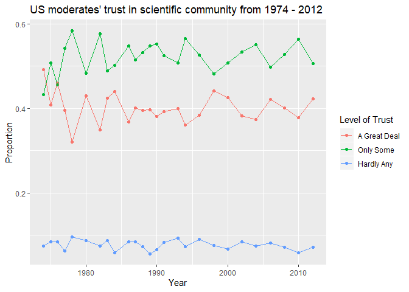
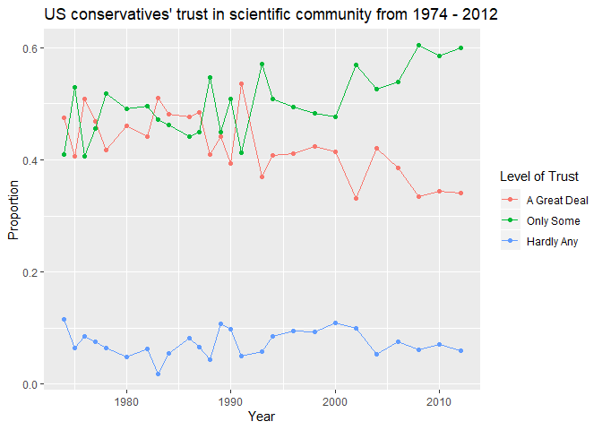
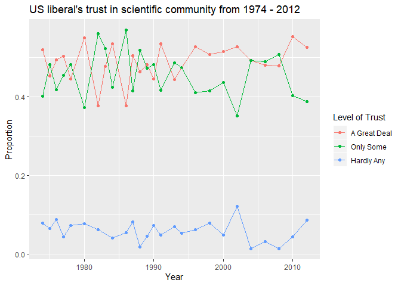
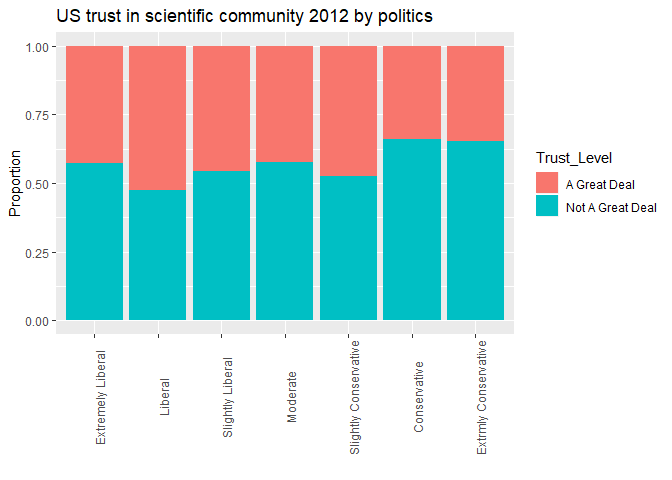

Confidence in the scientific community and political affiliation
================
Ian Finneran

## Setup

### Load packages

``` r
library(ggplot2)
library(dplyr)
library(statsr)
library(tidyr)
library(MASS)
```

### Load data

``` r
load("gss.Rdata")
```

-----

## Part 1: Data

[The General Social Survey (GSS)](http://gss.norc.org/) covers US
attitudes and perspectives about topics including society, institutions,
race relations, federal spending, crime, and religion. Samples were
collected annually from 1972 to 1993 and biannually in even number years
from 1994 to 2018 by the National Opinion Research Center at the
University of Chicago (funded by the National Science Foundation).
Samples were chosen randomly from US households, so they can be
generalized to the US population as a whole. The sample size is roughly
1500 for each survey (ranging from 1372 to 1613). Since it is an
observational survey, association can be measured. Causation cannot be
measured, as respondents were not randomly assigned.

-----

## Part 2: Research question

Were the political affiliations of Americans (liberal, conservative,
moderate, etc.) associated with confidence in the scientific community
in 1990 and 2012? Popular media often suggests that either conservatives
or liberals don’t trust the scientific community. I am curious to see if
there is any association.

-----

## Part 3: Exploratory data analysis

First let’s access the data, select the consci, polviews, and year
columns, and drop NA values. Here are some summary statistics for each
column:

``` r
df <- gss %>% dplyr::select(year, consci, polviews) %>% drop_na() 
summary(df)
```

    ##       year               consci                       polviews    
    ##  Min.   :1974   A Great Deal:14165   Extremely Liberal    :  911  
    ##  1st Qu.:1982   Only Some   :16077   Liberal              : 3725  
    ##  Median :1990   Hardly Any  : 2289   Slightly Liberal     : 4327  
    ##  Mean   :1991                        Moderate             :12434  
    ##  3rd Qu.:2000                        Slightly Conservative: 5421  
    ##  Max.   :2012                        Conservative         : 4698  
    ##                                      Extrmly Conservative : 1015

Here we see that this dataset covers 1974 - 2012 and breaks up trust in
the scientific community into three levels: ‘A Great Deal’, ‘Only Some’,
and ‘Hardly Any’. Political views are broken into seven levels, ranging
from ‘Extremely Liberal’ to ‘Extremely Conservative’.

Next, I’ll make a new dataframe, df\_year, that groups the data by year,
political spectrum, and views about the scientific community. The total
counts and proportion of respondents is calculated within each
sub-group:

``` r
df_year <- df %>% group_by(year,polviews,consci) %>% 
  summarise(n=n()) %>% mutate(Proportion = n / sum(n))  
df_year
```

    ## # A tibble: 543 x 5
    ## # Groups:   year, polviews [182]
    ##     year polviews          consci           n Proportion
    ##    <int> <fct>             <fct>        <int>      <dbl>
    ##  1  1974 Extremely Liberal A Great Deal     9     0.429 
    ##  2  1974 Extremely Liberal Only Some       10     0.476 
    ##  3  1974 Extremely Liberal Hardly Any       2     0.0952
    ##  4  1974 Liberal           A Great Deal    93     0.520 
    ##  5  1974 Liberal           Only Some       72     0.402 
    ##  6  1974 Liberal           Hardly Any      14     0.0782
    ##  7  1974 Slightly Liberal  A Great Deal    93     0.497 
    ##  8  1974 Slightly Liberal  Only Some       85     0.455 
    ##  9  1974 Slightly Liberal  Hardly Any       9     0.0481
    ## 10  1974 Moderate          A Great Deal   257     0.492 
    ## # ... with 533 more rows

Now, I’ll plot the results for self-identified moderates from 1974 -
2012:

``` r
df_year %>% filter(polviews=='Moderate') %>% ggplot(aes(x=year,y=Proportion,color=consci)) +
  geom_point() + 
  geom_line() + 
  xlab('Year') + 
  ylab('Proportion') + 
  labs(color = 'Level of Trust', 
       title='US moderates\' trust in scientific community from 1974 - 2012')
```

<!-- -->

It seems that the level of trust in the scientific community has been
reasonably constant over this time frame with about 40% of respondents
reporting ‘A Great Deal’.

Next, let’s look at the results for self-identified conservatives:

``` r
df_year %>% filter(polviews=='Conservative') %>% ggplot(aes(x=year,y=Proportion,color=consci)) +
  geom_point() + 
  geom_line() + 
  xlab('Year') + 
  ylab('Proportion') + 
  labs(color = 'Level of Trust', 
       title='US conservatives\' trust in scientific community from 1974 - 2012')
```

<!-- -->

This plot looks a little more interesting. It seems to suggest that
conservatives’ trust in the scientific community was constant from 1974
- 2000, but it has been decreasing from 2000 - 2012.

Finally, let’s look at self-identified liberals:

``` r
df_year %>% filter(polviews=='Liberal') %>% ggplot(aes(x=year,y=Proportion,color=consci)) +
  geom_point() + 
  geom_line() + 
  xlab('Year') + 
  ylab('Proportion') + 
  labs(color = 'Level of Trust', 
       title='US liberal\'s trust in scientific community from 1974 - 2012')
```

<!-- -->

These results seem to be fairly constant over this time frame, although
there may have been an increase in the ‘Only Some’ category around 2005.

Let’s take a more detailed look at the data for 2012. First, I’ll
collapse the trust levels into two categories: ‘A Great Deal’ and ‘Not A
Great Deal’:

``` r
df_collapsed <- df %>% filter(year==2012) %>%
  mutate(Trust_Level = ifelse(consci=='A Great Deal',
                          'A Great Deal',
                          'Not A Great Deal')) %>% 
  dplyr::select(polviews, Trust_Level)
```

Then, I group by self-identified political view and calculate the
proportion in each sub-category:

``` r
df_grouped <- df_collapsed %>% group_by(polviews,Trust_Level) %>% summarise(n=n()) %>% mutate(freq = n / sum(n)) 
df_grouped
```

    ## # A tibble: 14 x 4
    ## # Groups:   polviews [7]
    ##    polviews              Trust_Level          n  freq
    ##    <fct>                 <chr>            <int> <dbl>
    ##  1 Extremely Liberal     A Great Deal        24 0.429
    ##  2 Extremely Liberal     Not A Great Deal    32 0.571
    ##  3 Liberal               A Great Deal        80 0.526
    ##  4 Liberal               Not A Great Deal    72 0.474
    ##  5 Slightly Liberal      A Great Deal        62 0.456
    ##  6 Slightly Liberal      Not A Great Deal    74 0.544
    ##  7 Moderate              A Great Deal       190 0.422
    ##  8 Moderate              Not A Great Deal   260 0.578
    ##  9 Slightly Conservative A Great Deal        89 0.473
    ## 10 Slightly Conservative Not A Great Deal    99 0.527
    ## 11 Conservative          A Great Deal        63 0.341
    ## 12 Conservative          Not A Great Deal   122 0.659
    ## 13 Extrmly Conservative  A Great Deal        16 0.348
    ## 14 Extrmly Conservative  Not A Great Deal    30 0.652

Now I’ll plot the proportions for each of the categories:

``` r
ggplot(df_grouped, aes(fill=Trust_Level, y=freq, x=polviews)) + 
    geom_bar( stat="identity") + 
  theme(axis.text.x = element_text(angle = 90)) + 
    xlab('') + 
  ylab('Proportion') + 
  labs(color = 'Level of Trust', 
       title='US trust in scientific community 2012 by politics')
```

<!-- -->

This plot shows the highest levels of distrust among conservative and
extremely conservative respondents. It is not monotonically changing
over the political spectrum, however, as there are higher levels of
moderates and extremely liberal respondents with not a great deal of
trust in the scientific community.

Now, let’s do hypothesis testing of these data to see if there is a
statistically significant association between these variables.

-----

## Part 4: Inference

The null and alternative hypothesis test for the research question are
as follows:

H<sub>0</sub>: Political views and trust in the scientific community are
independent (not associated).

H<sub>A</sub>: Political views and trust in the scientific community are
dependent (associated).

I’ll be testing this hypothesis for two years (1990 and 2012). I’ll use
a Bonferroni modified significance level of .05/2 = .025 since we are
doing 2 comparisons.

I am interested in seeing if there is an association between a 7 level
and 2 level categorical variable, so the reduced chi squared test is the
appropriate method. I will not be calculating the confidence interval,
since one of the categorical variables has more than 2 levels. The chi
squared value is calculated as the total sum of (observed - expected
counts)^2/expected counts. Then, the total degrees of freedom are
calculated as (number of rows-1)x(number of columns-1) in the 2-way
table. Finally, the p-value is calculated as the upper tail of the
calculated chi squared distribution for a particular number of degrees
of freedom.

To carry out this test the data must meet two conditions:

1)  Each respondent must be independent from the other respondents. I
    assume this to be true, based on the reported methodology of the
    GSS.

2)  Each bin must have 5 expected cases. Let’s see if our data meet this
    requirement.

First I’ll take a look at the two way table for this scenario. Again,
I’m dividing trust into 2 categories (‘A Great Deal’ and ‘Not A Great
Deal’):

``` r
df_1990 <- df %>% filter(year==1990) %>% 
  mutate(sciview = ifelse(consci=='A Great Deal',
                          'A Great Deal',
                          'Not A Great Deal'))
tbl_1990 = table(df_1990$sciview, df_1990$polviews) 
tbl_1990
```

    ##                   
    ##                    Extremely Liberal Liberal Slightly Liberal Moderate
    ##   A Great Deal                    10      37               55      104
    ##   Not A Great Deal                10      46               63      169
    ##                   
    ##                    Slightly Conservative Conservative Extrmly Conservative
    ##   A Great Deal                        70           48                    8
    ##   Not A Great Deal                    83           74                   25

Next, I need to calculate the expected counts if the null hypothesis is
true (condition 2). I’ll do this following the guide provided
[here](https://www.cyclismo.org/tutorial/R/tables.html). Each value is
calculated as the row total \* column total/table total. If the data
doesn’t meet 5 expected counts condition, I’ll need to run a simulation
to calculate the p-value.

``` r
as.array(margin.table(tbl_1990,1)) %*% t(as.array(margin.table(tbl_1990,2))) /
  margin.table(tbl_1990)
```

    ##                   
    ##                    Extremely Liberal Liberal Slightly Liberal Moderate
    ##   A Great Deal              8.279302 34.3591         48.84788 113.0125
    ##   Not A Great Deal         11.720698 48.6409         69.15212 159.9875
    ##                   
    ##                    Slightly Conservative Conservative Extrmly Conservative
    ##   A Great Deal                  63.33666     50.50374             13.66085
    ##   Not A Great Deal              89.66334     71.49626             19.33915

All expected counts are above 5, so we can use the chi squared test on
this data set. Now let’s check for 2012:

``` r
df_2012 <- df %>% filter(year==2012) %>% 
  mutate(sciview = ifelse(consci=='A Great Deal',
                          'A Great Deal',
                          'Not A Great Deal'))
tbl_2012 = table(df_2012$sciview, df_2012$polviews) 
as.array(margin.table(tbl_2012,1)) %*% t(as.array(margin.table(tbl_2012,2))) /
  margin.table(tbl_2012)
```

    ##                   
    ##                    Extremely Liberal Liberal Slightly Liberal Moderate
    ##   A Great Deal              24.19126  65.662         58.75021 194.3941
    ##   Not A Great Deal          31.80874  86.338         77.24979 255.6059
    ##                   
    ##                    Slightly Conservative Conservative Extrmly Conservative
    ##   A Great Deal                  81.21352     79.91756             19.87139
    ##   Not A Great Deal             106.78648    105.08244             26.12861

These are also all above 5 counts, so the chi squared test is
appropriate. No simulations are needed. I can now proceed with the chi
squared test for 1990:

``` r
chisq.test(tbl_1990)
```

    ## 
    ##  Pearson's Chi-squared test
    ## 
    ## data:  tbl_1990
    ## X-squared = 8.9159, df = 6, p-value = 0.1784

In this case p=0.18, which is greater than our significance value of
.025. So, I fail to reject the null hypothesis. In other words, the data
do not provide convincing evidence that self-identified political
affiliation and trust in the scientific community were associated in
1990.

Now let’s perform the chi squared test for 2012:

``` r
chisq.test(tbl_2012)
```

    ## 
    ##  Pearson's Chi-squared test
    ## 
    ## data:  tbl_2012
    ## X-squared = 14.953, df = 6, p-value = 0.02063

In this case, p=.021, which is smaller than .025. I reject the null
hypothesis in favor of the alternative hypothesis. Specifically, the
self-identified political affiliation and trust in the scientific
community among Americans were associated (dependent) in the year 2012.
This test doesn’t say anything about how they were associated, however,
only that they are associated. To answer the question of how they are
associated we would need to do further tests.
